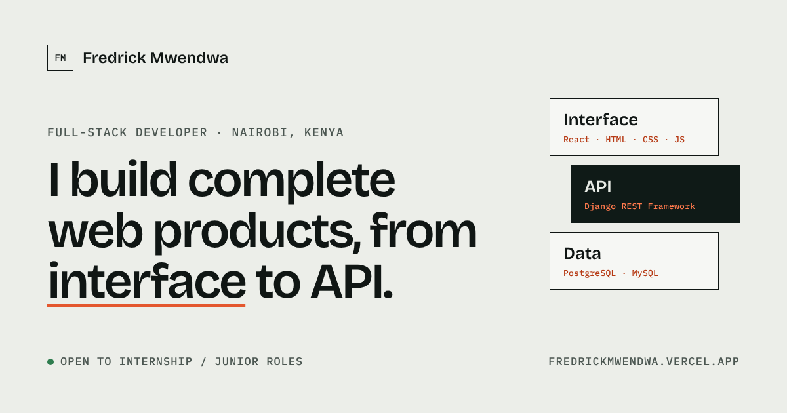

# Fredrick Mwendwa | Portfolio

A fast, accessible, handcrafted portfolio for a full-stack developer based in Nairobi, Kenya. Built with React and Vite, prerendered at build time so it loads instantly and reads cleanly to search engines.

**Live site:** [fredrickmwendwa.vercel.app](https://fredrickmwendwa.vercel.app)



## Highlights

- **Prerendered React.** The page is rendered to static HTML at build time and hydrated in the browser, so content is visible before any JavaScript runs.
- **Considered motion.** Masked headline reveal, scroll-triggered section reveals, a reading progress bar and a header that hides on scroll down and returns on scroll up. All of it respects `prefers-reduced-motion`.
- **Light and dark themes.** Follows the system setting, with a manual toggle that remembers your choice and no flash on load.
- **Small interactions.** Magnetic buttons, a project index that previews each project under the cursor, and a mobile dock that tracks the section you are reading.
- **Hand-written CSS.** No UI framework. A small set of design tokens, a 12-column grid and fluid type scale.
- **Mobile first.** A bottom dock navigation replaces the header on small screens.
- **Accessible by default.** Semantic landmarks, visible focus states, skip link, live-region feedback and AA contrast.
- **Search ready.** Structured data, social cards, canonical URL, sitemap, robots rules and web manifest.

## Tech stack

| Area | Choice |
| --- | --- |
| UI | React 18 |
| Build tool | Vite 5 |
| Language | JavaScript (JSX) |
| Styling | Plain CSS with custom properties |
| Fonts | Bricolage Grotesque, Hanken Grotesk, IBM Plex Mono |
| Hosting | Vercel |

## Getting started

Requires Node.js 18.18 or newer.

```bash
git clone https://github.com/fredrickmwendwa/portfolio.git
cd portfolio
npm install
npm run dev
```

The dev server runs at `http://localhost:5173`.

| Command | What it does |
| --- | --- |
| `npm run dev` | Start the development server with hot reload |
| `npm run build` | Build, server-render and prerender into `dist/` |
| `npm run preview` | Serve the production build locally |

## Project structure

```
.
├── index.html            Document head, SEO tags and structured data
├── vercel.json           Security and cache headers
├── scripts/
│   └── prerender.mjs     Injects server-rendered HTML into the build
├── public/               Icons, social image, CV, 404 page, robots.txt, sitemap, manifest
└── src/
    ├── App.jsx           Page sections and components
    ├── data.js           All site content (projects, about, tools)
    ├── styles.css        Design tokens, layout and motion
    ├── main.jsx          Client entry (hydrates the prerendered page)
    └── entry-server.jsx  Server entry used at build time
```

## How the build works

1. `vite build` produces the client bundle.
2. `vite build --ssr` produces a small server bundle of the same app.
3. `scripts/prerender.mjs` renders the app to a string, writes it into `dist/index.html` and updates the sitemap date.

The result is plain static files, so the site can be hosted anywhere.

## Content

Everything on the page is driven from `src/data.js`: projects, about text, tools and working principles. Layout and styling live separately, so content changes do not touch components.

## Performance

- Static HTML delivered first, JavaScript hydrates afterwards
- No runtime dependencies beyond React
- Immutable caching for hashed assets
- Fonts loaded with `display=swap`
- Images lazy loaded below the fold

## Deployment

The project deploys to Vercel with no configuration. Import the repository, keep the default Vite settings and Vercel runs `npm run build` and serves `dist/`.

## Author

**Fredrick Mwendwa**, full-stack developer, Nairobi.

- Email: [fredrickmwendwa77@gmail.com](mailto:fredrickmwendwa77@gmail.com)
- LinkedIn: [fredrick-mwendwa](https://linkedin.com/in/fredrick-mwendwa)
- GitHub: [fredrickmwendwa](https://github.com/fredrickmwendwa)

## License

The source is shared for reference and learning. The design, copy and imagery are personal and all rights are reserved, so please do not republish this site as your own.
